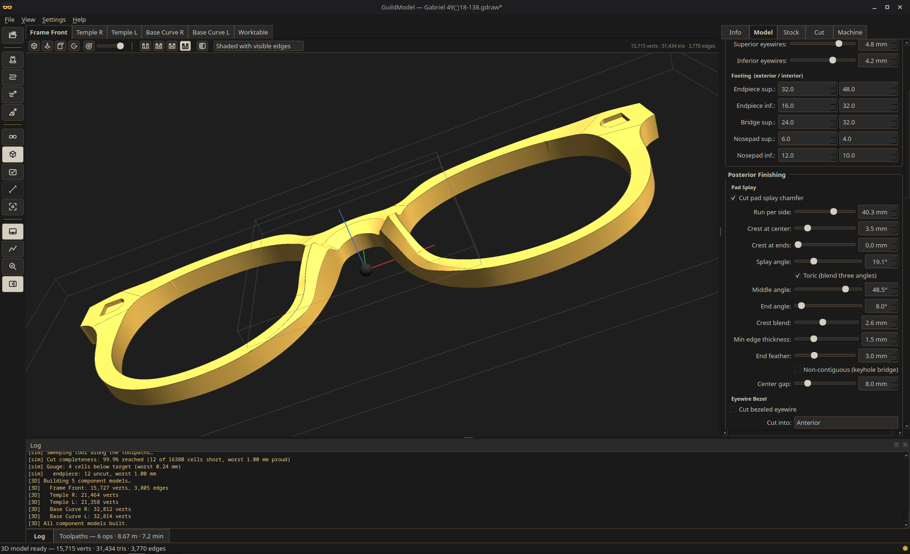

# GuildModel

Free, open-source CAM tool for spectacle frame cutting on GRBL CNC machines.

GuildModel takes a GuildDraw frame-front DXF and builds the posterior relief the
way a maker models it — the **castle**: tower zones (endpieces, bridge,
nosepads), eyewire walls, and rolling-ball footing fillets — then generates
the five-operation single-tool GRBL program (hinge pockets → rough relief →
fine relief → eyewires → perimeter, released by a hand-finished onion skin)
for the Guild CNC fixture.



## Status

**v1.5.0.** GuildModel builds the posterior castle relief and the
five-operation single-tool GRBL program for a frame front, its temples, and
per-lens base-curve forming blocks — with worktable nesting, cut simulation, a
maker's guide (`docs/USER-GUIDE.md`), and an optional lens bevel groove
(drageoir V-groove in each eyewire wall, off by default).

> **New in v1.5.0 — the posterior features answer to the maker.** The bridge relief's
> cross-section is now a **U with both corners named** — an exterior radius where
> it leaves the bridge face, an interior radius at the trough — in the same
> language the footing already uses; it had neither before, so there was nothing
> to turn. The pad splay can be cut **non-contiguous**, starting each half clear
> of a settable centre gap, so a **keyhole bridge** keeps its shape instead of
> being planed off. And the features are cut by their own **Features** operation
> with its own tool: a ball nose for the chamfers and scoops, an end mill for the
> hinges, footing and sculpting. *Fixed with them: the two solid kernels had been
> cutting a half-ellipse where the heightfield the CAM posts from carved a cosine
> bell — 57% more material removed than the program believed. All three kernels
> now build the same section.*

> **Fixed — the spike of material at the nosepad.** A footing blend is swept
> along its seam, so it stops flat at its last station and leaves standing
> whatever the frame's outline flares back underneath it: a fin of raw blank
> where the nosepad meets the bridge, **2.4 mm** proud on a maker's frame. Since
> v1.4.0 the model kernel is also what the CAM posts from, so it was going to be
> cut, not just seen. How far that end has to travel to clear the zone is a
> property of the drawing rather than a constant, and it is now measured per seam
> end — **every frame we have was short, this repo's own three fixtures
> included.** Nothing to set; reopen a drawing and rebuild.

> **Also fixed — the pad splay's run-out, and a turntable to see it with.** The
> end feather scaled the cut's *depth* but not its *width*, so a run ended as a
> flat shelf at full width and then stopped dead — invisible on a normal splay,
> because the crest is already tapering there, and 7.5 mm of sharp shelf on the
> inner ends of a **non-contiguous** one. It now lifts the chamfer out of the
> surface at full width and angle, so the cut narrows away to nothing at every
> end. Same slider, no new control. And the 3D viewer has a **turntable** —
> the LP button beside the camera presets, or `Alt+T`, with a speed slider; it
> spins about the view you set up, so tip the part first and it turns on that
> axis.

> **Fixed — Trim start / Trim end, and the turntable's hotkey.** The trim
> sliders on an edge feature did nothing at all on any feature without a zone
> filter, which is most of them: the span was handed back before the trims were
> applied. They work now, whole-ring runs included — trimming is how you turn a
> round-over that goes all the way round into one with two real ends. Making
> them live also turned up a cutter that stopped flush *in* the face it was
> leaving rather than crossing it, which could leave a run's end unexportable;
> that is fixed for every edge feature, trimmed or not. And `Alt+T` never
> reached the turntable — the binding was correct, but the action sat in no menu
> and on no toolbar, so nothing could fire it; rebinding it in Preferences
> didn't help for the same reason. Every rebindable action is now reachable by
> its key.

> **New in v1.4.0 — the frame has a front (first V2 instalment).** The model now
> carries an **anterior surface** as well as the posterior castle, and a new
> **Edge Features** list on the Model tab cuts partial-span chamfers and fillets
> into either face — the anterior brow chamfer over each eyewire, stopping short
> of the bridge, that thick modern frames want. A run's span is chosen by castle
> zone, tapers to nothing at each end, can vary in width along its length, and
> mirrors to the other side as one feature. The eyewire bezel can now be cut into
> the front face instead of, or as well as, the back. **This is modelling and 3D
> preview only** — machining the front needs the flip setup, which is the next
> milestone. Posterior programs are unchanged.

> **New in v1.3.0 — toolpath control.** The Cut tab now decides how the part is
> held (onion skin or hold-down tabs), which operations run at all (uncheck one to
> cut a job in stages), and what any single component overrides from the project's
> CAM settings — most usefully its material, so acetal forming blocks stop
> inheriting the acetate frame's depth per pass. The Machine tab adds climb /
> conventional milling and a ramp-or-plunge lead-in. Defaults are unchanged, so an
> existing project posts exactly as it did in v1.2.0. **Hold-down tabs are new and
> have not been cut on real stock** — air-cut the first one.

> **Upgrading from v1.1.0 — this changes how deep your programs cut.** Depth per
> pass was set on a frame-only panel that was hidden whenever a temple or
> base-curve block was the active component, and the shipped default asked for a
> 4 mm bite: a stock 4 mm temple blank came out as **one full-depth pass**, with no
> control to change it. Depth per pass now lives on the **Cut** tab for every
> component kind, with a read-out of the resulting pass count, and the shipped
> acetate default drops from 4.0 mm to 1.5 mm. Blind pockets and deep engraving
> step down too, and temple/base-curve programs finally honour the machine's and
> material's depth-of-cut ceiling. **Re-post any program you still have**, and
> treat the new pass structure as you would any new program — air-cut, then a test
> piece.

> **Upgrading from v1.0.0:** worktable programs built their relief on the
> 3D-preview grid rather than the cutting grid, which put a lot of unnecessary Z
> motion into the toolpath. Re-nest and re-post any `worktable.nc` you still have
> before running it — the fix is in the generator, not the file. Single-component
> programs were unaffected.

The **whole-bed workflow is now hardware-proven**: a complete nested worktable —
frame front, both temples, and both base-curve forming blocks — has been cut on
real stock in one program on the Guild CNC (LUNYEE 3020 Nova), on top of the
existing end-to-end frame-front proof (GuildDraw DXF → castle relief → five-op
GRBL program → cut on a Carbide 3D Nomad).

Still **beta**: the **lens bevel groove** (built and verified in cut-simulation,
off by default, not yet cut on real stock) — treat its first real cuts as you
would any new program (air-cut, then a test piece). The two-sided (cut-and-flip)
workflow is planned for a later release.

**Known issue — an edge feature can fold where an outline turns very sharply.**
Where a run passes a near-cusp — a corner turning tighter than the feature is
deep, such as the aviator fixture's endpiece at 58° in a quarter-millimetre —
the swept cut can cross itself and leave a model that will not export. The app
says so plainly in the log and the Inspector ("the model overlaps itself along
N edges") and does not count the model as built — though note that a program
you have already stored keeps the readiness dot green on its own merits, so
read the log rather than the dot after a rebuild. Nudging the run's
**Trim start** / **Trim end** past the corner, or
easing the corner in the drawing, clears it. Measured at **7 of 288** builds
across the three fixtures, both faces, both profiles and trims from 0.5 to
12 mm.

The milestone history and the reasoning behind each decision live in the commit
messages, which are written to be read.

## Requirements

Python 3.12 or newer (the packaged Windows installer bundles its own runtime —
no Python needed to run it).

## Install (Windows)

Download `GuildModel-<version>-setup.exe` from the release and run it. It is a
per-user install (no admin prompt) and registers the `.gmodel` project type. It
is not code-signed, so SmartScreen warns on first run — **More info ▸ Run
anyway**.

To build it yourself on Windows: `scripts\build_release.ps1` (needs
[Inno Setup](https://jrsoftware.org/isdl.php) for the installer; it produces the
portable `.zip` without it).

## Building releases without that platform

Neither release build needs a machine of its own. Both workflows are manual —
**Actions ▸ (workflow) ▸ Run workflow** — and upload their artifacts for you to
attach to a GitHub release:

| Workflow | Runner | Artifacts |
|---|---|---|
| `.github/workflows/windows-build.yml` | `windows-latest` | portable `.zip` + `setup.exe` |
| `.github/workflows/macos-build.yml` | `macos-14` (arm64), `macos-15-intel` (x86_64) | `.zip` + `.dmg` per architecture |

Each runs the same release script a maker would run locally
(`scripts\build_release.ps1` / `scripts/build_release_macos.sh`), so a CI build
and a hand build cannot drift apart. Both gate on the full test suite first.
PyInstaller does not cross-compile, which is why this is a matter of borrowing a
runner rather than building everything in one place.

## Installation (development)

```
pip install -e ".[dev]"
```

## Running the app

The install registers a `guildmodel` entry point:

```
guildmodel
```

or, without activating the venv:

```
.venv\Scripts\guildmodel.exe          # Windows
.venv\Scripts\python -m guildmodel.gui.app
```

The app opens with an empty workspace; use **File ▸ Open Drawing** (a GuildDraw
`.gdraw`) or **File ▸ Open DXF** to load a design. A reference frame front that
exercises the full castle pipeline (9 zones, hinge pockets, five-op G-code) is
vendored under `tests/fixtures/demo/`.

### Linux / Wayland — handled automatically

**You should not have to do anything here.** Both of the workarounds this
section used to ask for are now applied by the app at startup; the detail below
is for anyone who wants to override them or is debugging.

PyVista/VTK's Linux renderer (`vtkXOpenGLRenderWindow`) is X11-only. Under Qt's
native `wayland` plugin it cannot embed its render window — `BadWindow` on
`X_ConfigureWindow`, then a segfault the moment you build a 3D model. So on a
Wayland session GuildModel selects the `xcb` plugin (XWayland) for itself before
Qt starts. Re-tested 2026-08-07 on VTK 9.6.2 / PySide6 6.11.1 / KDE Plasma:
still required, not a stale workaround.

Running under XWayland means Qt is told the screen is 96 DPI whatever the panel
actually is, and there is no compositor scale to fall back on, so the UI comes
out small — about 68% of intended size on a 141 DPI laptop panel. GuildModel
measures the panel's true DPI and scales both the application font *and* the
stylesheet to match. (Scaling the stylesheet is the part `QT_FONT_DPI` cannot
do: Qt stylesheet `px` is a device-independent unit that ignores font DPI, and
this app pins every font size in `px`. That is why the old `QT_FONT_DPI` advice
only half-worked.)

To override, set any of these and the app will leave the scale alone:

```
QT_SCALE_FACTOR=1.25 guildmodel      # or QT_FONT_DPI, QT_SCREEN_SCALE_FACTORS
QT_QPA_PLATFORM=wayland guildmodel   # force the native plugin (3D will crash)
```

Or pin it in **Preferences** — the `ui_scale` setting takes `"auto"` (the
default), or a number; `1.0` turns scaling off entirely.

## Running tests

```
pytest
```

## License

GPLv3 or later. See `LICENSE`.
